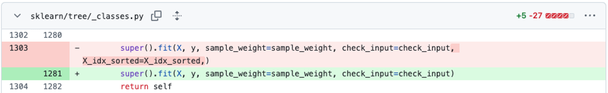

# 用户实验介绍
本实验是 Warmup 实验，旨在帮助你熟悉 **完整的实验流程** 和 **工具交互**。

## 任务介绍
我们希望去除决策树中 `fit` 方法中的参数 `X_idx_sorted`。该参数已经被标记为弃用。
首个编辑发生在 [`sklearn/tree/_classes.py`](sklearn/tree/_classes.py) 文件中，我们为 `DecisionTreeRegressor` 类的 `fit` 方法删除了 `X_idx_sorted` 参数，如图所示：



请你在完成所示修改后，继续对项目进行 **另外 7 处** 修改。你可以打开源代码管理工具，查看修改的数量，确保你确实完成了 7 处修改，如图所示：


如果你觉得修改的次数不够，可以继续修改，直到实现编辑目标（即通过 [验证修改](#验证修改) 中的测试）

## 编辑描述
当你需要输入编辑描述时，你可以直接复制以下内容：
```
MNT remove X_idx_sorted parameter in decision trees
```
你也可以输入其他内容，如果您使用的是 TRACE 或 CoEdPilot，请勿输入 ASCII 以外的字符。

## 温馨提示
1. 请处理和 `X_idx_sorted` 相关的内容，包括代码和注释文档。

## 验证修改
请运行以下命令验证修改：
```bash
python -m test.test
```

当修改正确时，测试会输出以下信息：
```bash
Test passed
```
当显示 `Test passed` 时，说明你已经完成了所有修改。